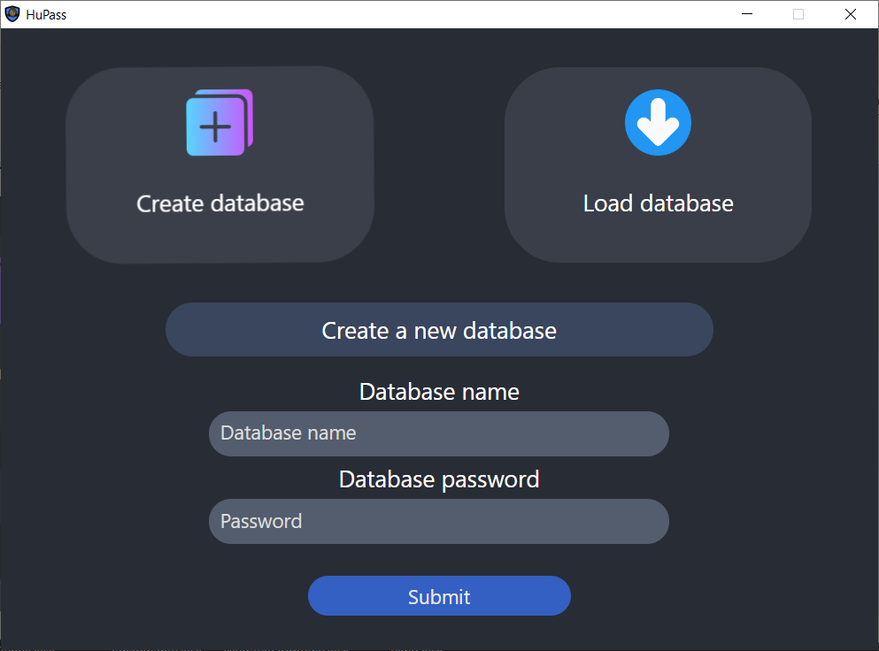
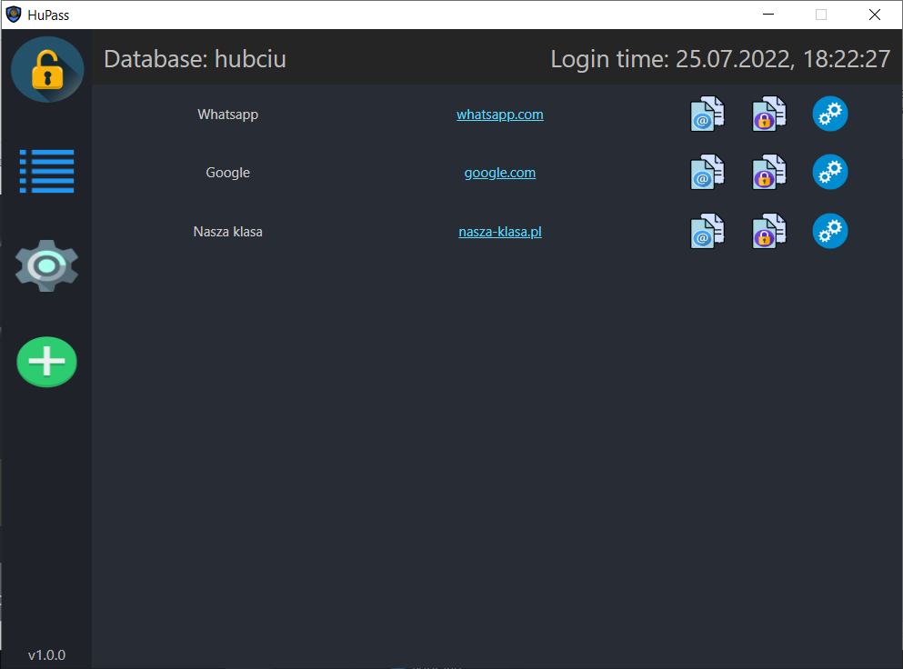

# hupass
A simple password manager written in React and Python technology.

## Features:
- Creating encrypted databases that have their own extension.
- Loading existing databases
- Encryption
- Ability to copy logins and passwords to sites without seeing passwords.
- Ability to open saved addresses with one click.
- Ability to change the main database password after logging in.
- Animations 

## Images:

*Start page*

*Database creator*

*Authentication process*

*Home page*

*Add new record*

*Settings*